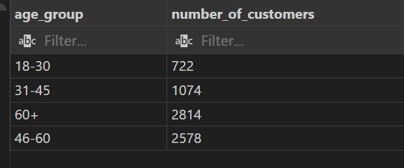

# 🏨 Hotel Booking Analytics Using Power BI & PostgreSQL

## 📘 Overview

In today’s competitive hospitality industry, making data-driven decisions is essential for improving customer satisfaction, optimizing operations, and increasing profitability. This project leverages SQL and Power BI to build a comprehensive analytics solution for hotel bookings, based on staging tables stored in PostgreSQL.

With clearly defined analytical views and an interactive Power BI dashboard, this project answers essential business questions such as:

- Who are our customers and where do they come from?
- Which room types generate the most revenue?
- What are the seasonal trends in bookings?
- How efficiently are our rooms being utilized?

---

## ❓ Problem Statement

Hotel managers and stakeholders often lack visibility into their operations due to fragmented or raw data sources. Without clear insights into customer demographics, room occupancy, payment methods, and seasonal trends, it's difficult to make informed decisions that can improve revenue, enhance customer experience, or optimize resource allocation.

This project solves that problem by transforming raw booking and customer data into meaningful views using SQL, and visualizing the results in Power BI. The views serve as a semantic layer between the data source and the dashboard, making analytics accessible, accurate, and actionable.

---

## 🔍 Key Questions Answered (via SQL Views)

Each SQL view was designed to answer a specific business question:
## 🗃️ SQL Views

All PostgreSQL views used in the Power BI report are defined in the [`powerbiview.sql`](./sql_queries/powerbiviews.sql) file. 

To use them:
1. Load your data into the staging tables:
   - `customers_staging`
   - `orders_staging`
   - `rooms_staging`
2. Execute the SQL file in your PostgreSQL database.
3. The views will become available for connection in Power BI.


### 1. **Customer Demographics**
- **`vw_customer_age_groups`**: What is the age distribution of our customers?
- **`vw_customer_gender_distribution`**: What is the gender breakdown?
- **`vw_customer_country_distribution`**: Where do our customers come from?

### 2. **Revenue Insights**
- **`vw_revenue_per_room_type`**: Which room types bring in the most revenue?
- **`vw_revenue_by_payment_method`**: Which payment methods are most commonly used?
- **`vw_top_countries_by_revenue`**: Which countries contribute the most to our revenue?

### 3. **Operational Efficiency**
- **`vw_avg_stay_per_room_type`**: What’s the average stay duration for each room type?
- **`vw_occupancy_rate_per_room`**: How efficiently is each room being utilized over time?

### 4. **Seasonal Trends**
- **`vw_seasonal_booking_trends`**: What are the booking and revenue patterns across different seasons?

### 5. **Master Analytical View**
- **`vw_master_bookings`**: A comprehensive view combining orders, customer details, and room data — used as the foundation for most visualizations in the Power BI report.

---

## 📊 Deliverables

- **SQL File**: `powerbiview.sql` — all analytical views built on top of PostgreSQL staging tables.
- **Power BI Report**: `hotel_booking_analytics.pbix` — final report with dashboards and insights built using the views.

---

## 🛠️ Tech Stack

- **Database**: PostgreSQL
- **Visualization**: Power BI
- **Language**: SQL (PostgreSQL dialect)
- **Editor**: Visual Studio Code

---

## 🚀 How to Use


This project uses PostgreSQL for data processing and Power BI for visualization. Follow the steps below to recreate the setup:

1. **Create the base tables** using the schema in [`tables_creation.sql`](./sql_queries/tables_creation.sql).

2. **Load the raw data** from CSV files into the base tables using [`copy_data.sql`](./sql_queries/copy_data.sql).

3. **Create staging tables** (for safe data transformation) by running [`create_staging_tables.sql`](./sql_queries/create_staging_tables.sql).

4. **Create analytical views** that serve as the backbone of the Power BI dashboard using [`powerbiviews.sql`](./sql_queries/powerbiviews.sql).

#### SQL Query: Group Customers by Age Range

```sql
SELECT 
    CASE 
        WHEN CustomerAge < 18 THEN 'Under 18'
        WHEN CustomerAge BETWEEN 18 AND 30 THEN '18-30'
        WHEN CustomerAge BETWEEN 31 AND 45 THEN '31-45'
        WHEN CustomerAge BETWEEN 46 AND 60 THEN '46-60'
        ELSE '60+'
    END AS age_group,
    COUNT(*) AS number_of_customers
FROM customers_staging
GROUP BY age_group;
```
  

5. **Open the Power BI report** file [`hotel_booking_analytics.pbix`](./hotel_booking_analytics.pbix), connect it to your PostgreSQL database, and refresh the data to explore insights.

> ⚠️ Make sure PostgreSQL is running and accessible from Power BI during the connection step.
---
g

## 📬 Contact

For questions or collaboration inquiries, feel free to reach out via GitHub issues or pull requests.
You can also reach out through kimeudan05@gmail.com

